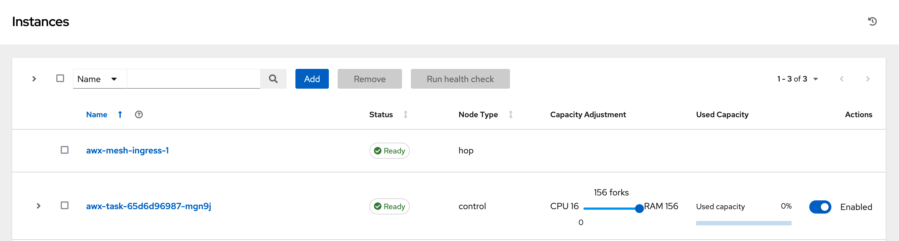
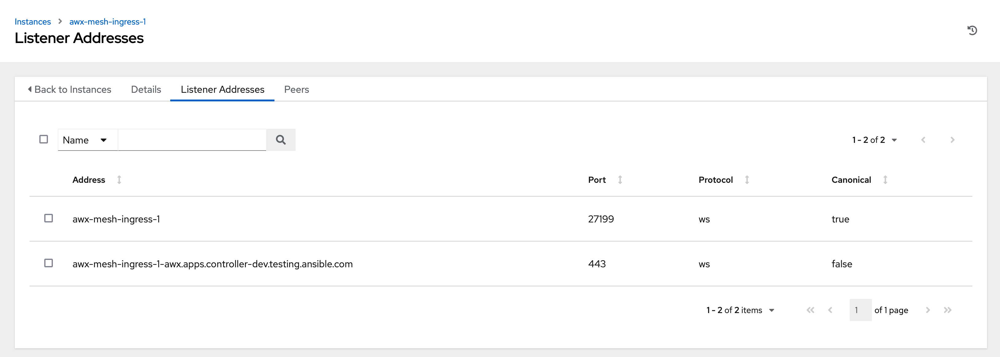
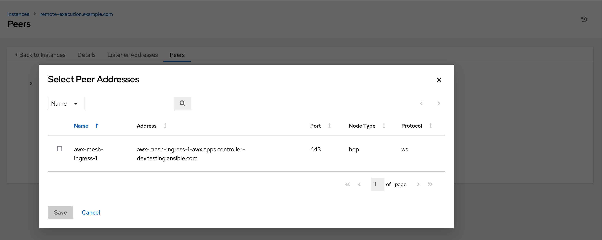

# Mesh Ingress

The mesh ingress allows users to peer external execution and hop nodes into the AWX control plane.
This guide focuses on how to enable and configure the mesh ingress.
For more information about remote execution and hop nodes and how to create them, refer to the [Managing Capacity With Instances](https://ansible.readthedocs.io/projects/awx/en/latest/administration/instances.html) chapter of the AWX Administration Guide.

## Prerequisites

- AWX operator version > 2.11.0
- AWX > 23.8.0

## Deploy and configure AWXMeshIngress

!!! note
    The mesh ingress uses the `control_plane_ee_image` and `image_pull_policy` fields of the AWX instance to determine image and policy to be adopted.
    Defaulted to `quay.io/ansible/awx-ee:latest` and `Always`.
    Currently there are no dedicated parameters to specify the image and policy.

### On Red Hat OpenShift with Operator managed Route

To deploy a mesh ingress on OpenShift, create the AWXMeshIngress resource on the namespace where your AWX instance is running on.

Example:

```yaml
---
apiVersion: awx.ansible.com/v1alpha1
kind: AWXMeshIngress
metadata:
  name: <mesh ingress name>
spec:
  deployment_name: <awx instance name>
```

### On Kubernetes with Operator managed Ingress (NGINX)

To deploy a mesh ingress on Kubernetes cluster which has [NGINX Ingress Controller](https://www.nginx.com/products/nginx-ingress-controller/), create the AWXMeshIngress resource on the namespace where your AWX instance is running on.

Note that AWXMeshIngress requires [SSL Passthrough](https://kubernetes.github.io/ingress-nginx/user-guide/tls/#ssl-passthrough) enabled which is disabled by default. Ensure it is enabled on your NGINX Ingress Controller.

By specifying `ingress_controller` as `nginx`, AWX Operator will generate Ingress resource that has `nginx.ingress.kubernetes.io/ssl-passthrough` annotation set to `"true"`.

Example:

```yaml
---
apiVersion: awx.ansible.com/v1alpha1
kind: AWXMeshIngress
metadata:
  name: <mesh ingress name>
spec:
  deployment_name: <awx instance name>

  ingress_type: Ingress
  ingress_controller: nginx
  ingress_class_name: nginx

  external_hostname: <fqdn for mesh ingress>
```

### On Kubernetes with Operator managed Ingress (Traefik)

To deploy a mesh ingress on Kubernetes cluster which has [Traefik Kubernetes Ingress provider](https://doc.traefik.io/traefik/providers/kubernetes-ingress/), create the AWXMeshIngress resource on the namespace where your AWX instance is running on.

Note that by deploying following AWXMeshIngress, AWX Operator will generate IngressRouteTCP resource that has `websecure` as an `entryPoints`. If this does not satisfy your requirement, refer to [User managed Ingress section](#on-kubernetes-with-user-managed-ingress) and  create an IngressRouteTCP resource manually.

Example:

```yaml
---
apiVersion: awx.ansible.com/v1alpha1
kind: AWXMeshIngress
metadata:
  name: <mesh ingress name>
spec:
  deployment_name: <awx instance name>

  ingress_type: IngressRouteTCP
  ingress_controller: traefik
  ingress_class_name: traefik
  ingress_api_version: traefik.io/v1alpha1

  external_hostname: <fqdn for mesh ingress>
```

!!! tip
    AWX Operator supports both API groups `traefik.io` and `traefik.containo.us` in `ingress_api_version` for Traefik, but it is recommended to use `traefik.io` since `traefik.containo.us` is deprecated in Traefik v2.10 and is removed in Traefik v3. Refer to [Traefik documentation](https://doc.traefik.io/traefik/migration/v2/#v210) for more information about deprecation.

    If you can't see any IngressRouteTCP resources by `kubectl` command after deploying mesh ingress, you should fully qualify the resource name with API group, `kubectl get ingressroutetcp.traefik.io` or `kubectl get ingressroutetcp.traefik.containo.us` for example.

### On Kubernetes with User managed Ingress

To deploy a mesh ingress on Kubernetes cluster, create the AWXMeshIngress resource on the namespace where your AWX instance is running on.

Alternatively, if you wish to create your own Ingress resource, you can deploy a mesh ingress with `ingress_type` set to `none` and then manually create an Ingress resource with any configuration.

In this case, the `external_hostname` is still required as it is used to generate the certificate that will be used by Receptor.

Example:

```yaml
---
apiVersion: awx.ansible.com/v1alpha1
kind: AWXMeshIngress
metadata:
  name: <mesh ingress name>
spec:
  deployment_name: <awx instance name>

  ingress_type: none  # This line can be omitted since this is the default value
  external_hostname: <fqdn for mesh ingress>
```

The requirements for user managed Ingress resource are as follows:

- Supports WebSocket
- SSL/TLS Passthrough enabled
- Accessible over port `443`
- Having the same hostname as `external_hostname` in the AWXMeshIngress resource
- Routing the traffic to port `27199` of the Service of the same name as the AWXMeshIngress resource

These are example Ingress resources for NGINX and Traefik.

```yaml
# Ingress for NGINX Ingress Controller
---
apiVersion: networking.k8s.io/v1
kind: Ingress
metadata:
  name: <mesh ingress name>
  annotations:
    nginx.ingress.kubernetes.io/ssl-passthrough: "true"
spec:
  ingressClassName: nginx
  rules:
    - host: <fqdn for mesh ingress>
      http:
        paths:
          - path: /
            pathType: Prefix
            backend:
              service:
                name: <mesh ingress name>
                port:
                  number: 27199
```

```yaml
# Ingress for Traefik Kubernetes Ingress provider
---
apiVersion: traefik.io/v1alpha1
kind: IngressRouteTCP
metadata:
  name: <mesh ingress name>
spec:
  entryPoints:
    - websecure
  routes:
    - match: HostSNI(`<fqdn for mesh ingress>`)
      services:
        - name: <mesh ingress name>
          port: 27199
  tls:
    passthrough: true
```

## Validating setup of Mesh Ingress

After AWXMeshIngress has been successfully created, a new Instance with the same name will be registered to AWX and will be visible on the Instance UI page



The Instance should have at least 2 listener addresses.

In this example, the mesh ingress has two listener addresses:

- one for internal, that is used for peering to by all control nodes (top)
- one for external, that is exposed to a route so external execution nodes can peer into it (bottom))



When selecting peer for new instance the mesh ingress instance should now be present as a option.


For more information about how to create external remote execution and hop nodes and configuring the mesh, see AWX Documentation on [Add a instance](https://ansible.readthedocs.io/projects/awx/en/latest/administration/instances.html#add-an-instance).

## Custom Resource Definitions

### AWXMeshIngress

AWXMeshIngress controls the deployment and configuration of mesh ingress on AWX

| Name                                                                                                                          | Description                                                                                                                                                         |
| ----------------------------------------------------------------------------------------------------------------------------- | ------------------------------------------------------------------------------------------------------------------------------------------------------------------- |
| **`apiVersion`**                                                                                                              | awx.ansible.com/v1alpha1                                                                                                                                            |
| **`kind`**                                                                                                                    | AWXMeshIngress                                                                                                                                                      |
| **`metadata`** ([ObjectMeta](https://kubernetes.io/docs/reference/kubernetes-api/common-definitions/object-meta/#ObjectMeta)) | Standard object's metadata. [More info](https://git.k8s.io/community/contributors/devel/sig-architecture/api-conventions.md#metadata)                               |
| **`spec`** ([AWXMeshIngressSpec](#awxmeshingressspec))                                                                        | Spec is the desired state of the AWXMeshIngress. [More info](https://git.k8s.io/community/contributors/devel/sig-architecture/api-conventions.md#spec-and-status)   |
| **`status`** ([AWXMeshIngressStatus](#awxmeshingressstatus))                                                                  | Status is the current state of the AWXMeshIngress. [More info](https://git.k8s.io/community/contributors/devel/sig-architecture/api-conventions.md#spec-and-status) |

#### AWXMeshIngressSpec

AWXMeshIngressSpec is the description of the configuration for AWXMeshIngress.

| Name                                     | Description                                                                                                                                                                                                                                 | Default                                        |
| ---------------------------------------- | ------------------------------------------------------------------------------------------------------------------------------------------------------------------------------------------------------------------------------------------- | ---------------------------------------------- |
| **`deployment_name`** (string), required | Name of the AWX deployment to create the Mesh Ingress for.                                                                                                                                                                                  | `awx`                                          |
| **`ingress_type`** (string)              | Ingress type for ingress managed by the operator. Options: `none`, `Ingress`, `IngressRouteTCP`, `Route`                                                                                                                                    | `Route` (on OpenShift), `none` (on Kubernetes) |
| **`external_hostname`** (string)         | External hostname is an optional field used for specifying the external hostname defined in an [Ingress](https://kubernetes.io/docs/concepts/services-networking/ingress/). This parameter is automatically generated on OpenShift          | N/A                                            |
| **`external_ipaddress`** (string)        | External IP Address is an optional field used for specifying the external IP address defined in an [Ingress](https://kubernetes.io/docs/concepts/services-networking/ingress/)                                                              | N/A                                            |
| **`ingress_api_version`** (string)       | API Version for ingress managed by the operator. This parameter is ignored when `ingress_type` is `Route`                                                                                                                                   | `networking.k8s.io/v1`                         |
| **`ingress_annotations`** (string)       | Additional annotation on the ingress managed by the operator. This parameter is ignored when `ingress_type` is `Route`                                                                                                                      | `""`                                           |
| **`ingress_controller`** (string)        | Special configuration for specific Ingress Controllers. This parameter is ignored when `ingress_type` is `Route`                                                                                                                            | `""`                                           |
| **`ingress_class_name`** (string)        | The name of ingress class to use instead of the cluster default. see [IngressSpec](https://kubernetes.io/docs/reference/kubernetes-api/service-resources/ingress-v1/#IngressSpec). This parameter is ignored when `ingress_type` is `Route` | `""`                                           |

#### AWXMeshIngressStatus

AWXMeshIngressStatus describe the current state of the AWXMeshIngress.

### AWXMeshIngressList

AWXMeshIngressList is a collection of AWXMeshIngress.

| Name                                                                                                                    | Description                                                                                                                                                                                                                                                                                          |
| ----------------------------------------------------------------------------------------------------------------------- | ---------------------------------------------------------------------------------------------------------------------------------------------------------------------------------------------------------------------------------------------------------------------------------------------------- |
| **`items`** ([AWXMeshIngress](#awxmeshingress))                                                                         | items is the list of Ingress.                                                                                                                                                                                                                                                                        |
| **`apiVersion`** (string)                                                                                               | APIVersion defines the versioned schema of this representation of an object. Servers should convert recognized schemas to the latest internal value, and may reject unrecognized values. [More info](https://git.k8s.io/community/contributors/devel/sig-architecture/api-conventions.md#resources)  |
| **`kind`** (string)                                                                                                     | Kind is a string value representing the REST resource this object represents. Servers may infer this from the endpoint the client submits requests to. Cannot be updated. In CamelCase. [More info](https://git.k8s.io/community/contributors/devel/sig-architecture/api-conventions.md#types-kinds) |
| **`metadata`** ([ListMeta](https://kubernetes.io/docs/reference/kubernetes-api/common-definitions/list-meta/#ListMeta)) | Standard object's metadata. [More info](https://git.k8s.io/community/contributors/devel/sig-architecture/api-conventions.md#metadata)                                                                                                                                                                |
